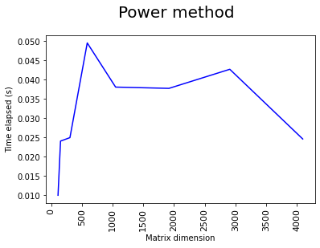
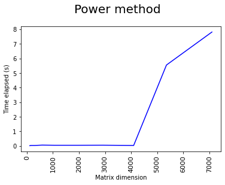
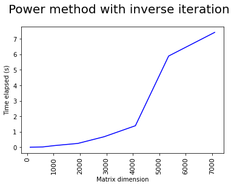
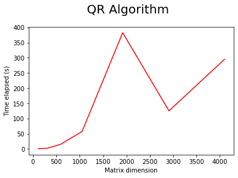

# Trabalho Computacional III - MAP2210 - Aplicações de Álgebra Linear  

## Determinação de autovalores e autovetores em matrizes SPD

> O critério de convergência utilizado em todo o desenvolvimento foi, em duas diferentes implementações, o da norma infinita.  

*1*. Norma infinita do vetor resultante da diferença entre dois vetores _x_ e _XO_ através da biblioteca numpy:  

```python
np.linalg.norm(x - XO, np.inf)
```

*2*. Função _infinite_norm_, aplicada sobre um vetor que retorna o valor de sua norma infinita e a posição do valor em sua estrutura:  
```python
import numpy as np


def infinite_norm(vector):
    
    max_element_index = np.argmax(vector)
    min_element_index = np.argmin(vector)
    
    if abs(vector[min_element_index]) == abs(vector[max_element_index]):
        if min_element_index < max_element_index:
            return min_element_index, vector[min_element_index]
        return max_element_index, vector[max_element_index]
    
    if abs(vector[min_element_index]) > abs(vector[max_element_index]):
        return min_element_index, vector[min_element_index]
    return max_element_index, vector[max_element_index]
```

>a. Escolha de 10 matrizes SPD.  

1. **bcsstk03**  
Dimensão: 112x112  
Esparsidade: 94%  
  
2. **bcsstk05**  
Dimensão: 153x153  
Esparsidade: 89.6%  
  
3. **mesh2em5**  
Dimensão: 306x306  
Esparsidade: 97.8%  
  
4. **bcsstk34**  
Dimensão: 588x588  
Esparsidade: 93.8%  
  
5. **msc01050**  
Dimensão: 1050x1050  
Esparsidade: 97%  
  
6. **plat1919**  
Dimensão: 1919x1919  
Esparsidade: 99%  
  
7. **nasa2910**  
Dimensão: 2910x2910  
Esparsidade: 97.94%  
  
8. **sts4098**  
Dimensão: 4098x4098  
Esparsidade: 99.56%  
  
9. **s3rmt3m3**  
Dimensão: 5357x5357  
Esparsidade: 99.27%  
  
10. **Muu**  
Dimensão: 7102x7102  
Esparsidade: 99.66%  
  

>b. Implementação do método da potência e obtenção dos raios espectrais.

```python
import numpy as np
import infinite_norm
import vector_normalization 

def power_method_coo(input_matrix, arbitrary_non_null_vector, tolerance, max_iterations):
    eigenvector = arbitrary_non_null_vector
    greatest_element_index, greatest_element = infinite_norm(eigenvector)
    eigenvector = vector_normalization(eigenvector, greatest_element)

    for current_iteration in range(max_iterations):
        matrix_eigenvector_product = input_matrix.dot(eigenvector)
        eigenvalue = matrix_eigenvector_product[greatest_element_index]
        greatest_element_index, greatest_element = infinite_norm(matrix_eigenvector_product)

        if abs(greatest_element) < 10 ** -18:
            print("The input matrix has the eigenvalue 0, select a new arbitrary vector and restart.")
            return 0, np.empty(len(input_matrix.todense()))

        error = np.linalg.norm(eigenvector - np.dot(matrix_eigenvector_product, 1 / greatest_element), np.inf)
        eigenvector = np.dot(matrix_eigenvector_product, 1 / greatest_element)  # Eigenvector

        if error < tolerance:
            return eigenvalue, eigenvector

    raise Exception("Maximum number of iterations exceeded. The procedure was unsuccessful.")
```

* Acima, o método da potência emprega como auxiliares as seguintes funções:  
1. _infinite_norm_, descrita no início do relatório.
2. _vector_normalization_, que, nesse caso, normaliza o vetor em relação ao seu maior elemento, isto é, todos os seus componentes são divididos pelo módulo do maior componente.
```python
def vector_normalization(vector, element):
    return np.dot(1 / element, vector)
```  

#### Tempo demandado pelos cálculos dos raios espectrais das matrizes  

##### Log:  
```python
-------- MATRIZ: bcsstk03 --------
Dimensão: 112
Tempo necessário para encontrar o raio espectral: 0.01s


-------- MATRIZ: bcsstk05 --------
Dimensão: 153
Tempo necessário para encontrar o raio espectral: 0.02s


-------- MATRIZ: mesh2em5 --------
Dimensão: 306
Tempo necessário para encontrar o raio espectral: 0.02s


-------- MATRIZ: bcsstk34 --------
Dimensão: 588
Tempo necessário para encontrar o raio espectral: 0.05s


-------- MATRIZ: msc01050 --------
Dimensão: 1050
Tempo necessário para encontrar o raio espectral: 0.04s


-------- MATRIZ: plat1919 --------
Dimensão: 1919
Tempo necessário para encontrar o raio espectral: 0.04s


-------- MATRIZ: nasa2910 --------
Dimensão: 2910
Tempo necessário para encontrar o raio espectral: 0.04s


-------- MATRIZ: sts4098 --------
Dimensão: 4098
Tempo necessário para encontrar o raio espectral: 0.03s


-------- MATRIZ: s3rmt3m3 --------
Dimensão: 5357
Tempo necessário para encontrar o raio espectral: 5.98s


-------- MATRIZ: Muu --------
Dimensão: 7102
Tempo necessário para encontrar o raio espectral: 8.67s
```

##### Gráficos - Tempo x Dimensão da matriz:  
* Oito primeiras matrizes, em ordem crescente pela dimensão:  
      
    
* Todas as matrizes:  
      

> Discussão sobre a diferenca de tempo, sobre o processo, etc.


> c. Utilização do método da potência inverso como otimizador do método da potência.

```python
import numpy as np
import infinite_norm
import vector_normalization 


def inverse_power_method(input_matrix, eigenvector_approximation, tolerance, max_iterations):
    input_matrix_dimension = len(input_matrix)

    transpose_product = np.dot(eigenvector_approximation, input_matrix)
    rayleigh_quotient = np.dot(transpose_product, eigenvector_approximation) / np.dot(eigenvector_approximation,
                                                                                      eigenvector_approximation)

    greatest_element_index, greatest_element = infinite_norm(eigenvector_approximation)
    eigenvector_approximation = vector_normalization(eigenvector_approximation, greatest_element)

    for current_iteration in range(max_iterations):
        rayleigh_identity = np.dot(rayleigh_quotient, np.identity(input_matrix_dimension))
        auxiliary_matrix = np.subtract(input_matrix, rayleigh_identity)

        try:
            y = np.linalg.solve(auxiliary_matrix, eigenvector_approximation)
        except LinAlgError:
            print("y does not have unique solution, so {} is an eigenvalue".format(rayleigh_quotient))
            return rayleigh_quotient, np.empty(0)

        eigenvalue = y[greatest_element_index]
        greatest_element_index, greatest_element = infinite_norm(y)

        y_quotient = np.dot(y, 1 / greatest_element)
        error_index, error = infinite_norm(np.subtract(eigenvector_approximation, y_quotient))
        eigenvector_approximation = np.dot(y, 1 / greatest_element)

        if error < tolerance:
            eigenvalue = 1 / eigenvalue + rayleigh_quotient
            return eigenvalue, eigenvector_approximation

    raise Exception("Maximum number of iterations exceeded. The procedure was unsuccessful.")
```

* Assim, o método da potência será alterado para delegar ao método da potência inverso o processo de encontrar o raio espectral.  
A partir do momento em que o erro calculado valer 10^-4, o método da potência inversa calcula em poucas iterações o autovalor e o autovetor correspondente utilizando como aproximação inicial o autovetor gerado pelo método da potência.  
É importante notar que, embora o método da potência convirja mais rapidamente, ele realiza cálculos computacionalmente caros, como, por exemplo, a inversa de uma matriz.  

* Método da potência otimizado:  
```python
import numpy as np
import infinite_norm
import vector_normalization 


def power_method_with_inverse_iteration(input_matrix, arbitrary_non_null_vector, tolerance, max_iterations):
    eigenvector = arbitrary_non_null_vector
    greatest_element_index, greatest_element = infinite_norm(eigenvector)
    eigenvector = vector_normalization(eigenvector, greatest_element)

    for current_iteration in range(max_iterations):
        matrix_eigenvector_product = input_matrix.dot(eigenvector)
        greatest_element_index, greatest_element = infinite_norm(matrix_eigenvector_product)

        if abs(greatest_element) < 10 ** -18:
            print("The input matrix has the eigenvalue 0, select a new arbitrary vector and restart.")
            return 0, np.empty(len(input_matrix.todense()))

        error = np.linalg.norm(eigenvector - np.dot(matrix_eigenvector_product, 1 / greatest_element), np.inf)
        eigenvector = np.dot(matrix_eigenvector_product, 1 / greatest_element)

        if error < 10 ** -4:
            eigenvalue, eigenvector = inverse_power_method(np.copy(input_matrix.todense()), eigenvector,
                                                           tolerance, max_iterations)
            return eigenvalue, eigenvector

    raise Exception("Maximum number of iterations exceeded. The procedure was unsuccessful.")
```  

#### Tempo necessário aos cálculos dos raios espectrais das matrizes utilizando o método da potência otimizado

##### Log:  

```python
-------- MATRIZ: bcsstk03 --------
Dimensão: 112
Tempo necessário para encontrar o raio espectral utilizando o método da potência inversa como otimizador: 0.00s


-------- MATRIZ: bcsstk05 --------
Dimensão: 153
Tempo necessário para encontrar o raio espectral utilizando o método da potência inversa como otimizador: 0.01s


-------- MATRIZ: mesh2em5 --------
Dimensão: 306
Tempo necessário para encontrar o raio espectral utilizando o método da potência inversa como otimizador: 0.01s


-------- MATRIZ: bcsstk34 --------
Dimensão: 588
Tempo necessário para encontrar o raio espectral utilizando o método da potência inversa como otimizador: 0.02s


-------- MATRIZ: msc01050 --------
Dimensão: 1050
Tempo necessário para encontrar o raio espectral utilizando o método da potência inversa como otimizador: 0.14s


-------- MATRIZ: plat1919 --------
Dimensão: 1919
Tempo necessário para encontrar o raio espectral utilizando o método da potência inversa como otimizador: 0.28s


-------- MATRIZ: nasa2910 --------
Dimensão: 2910
Tempo necessário para encontrar o raio espectral utilizando o método da potência inversa como otimizador: 0.78s


-------- MATRIZ: sts4098 --------
Dimensão: 4098
Tempo necessário para encontrar o raio espectral utilizando o método da potência inversa como otimizador: 1.48s


-------- MATRIZ: s3rmt3m3 --------
Dimensão: 5357
Tempo necessário para encontrar o raio espectral utilizando o método da potência inversa como otimizador: 5.97s


-------- MATRIZ: Muu --------
Dimensão: 7102
Tempo necessário para encontrar o raio espectral utilizando o método da potência inversa como otimizador: 7.56s
``` 

* Comentar que talvez o algoritmo otimizado tenha mais utilidade em matrizes de maior dimensão  
* Comentar demora maior em menores dimensões. 

##### Gráficos - Tempo x Dimensão da matriz:  
  
     
>d. Código e aplicação do algoritmo QR para encontrar todos os autovalores de uma matriz quadrada  

```python
import numpy as np


def qr_iteration_eigenvalues(A, precision):
    previous_iteration = A[0][0] + 1

    while abs(previous_iteration - A[0][0]) > precision:
        previous_iteration = A[0][0]
        Q, R = np.linalg.qr(A)
        A = np.dot(R, Q)

    return np.diag(A)
```

#### Tempo para calcular todos os autovalores das matrizes  

##### Log:  

```python
-------- MATRIZ: bcsstk03 --------
Quantidade de autovalores: 112
Tempo necessário para encontrar todos os autovalores: 0.21s


-------- MATRIZ: bcsstk05 --------
Quantidade de autovalores: 153
Tempo necessário para encontrar todos os autovalores: 1.03s


-------- MATRIZ: mesh2em5 --------
Quantidade de autovalores: 306
Tempo necessário para encontrar todos os autovalores: 2.06s


-------- MATRIZ: bcsstk34 --------
Quantidade de autovalores: 588
Tempo necessário para encontrar todos os autovalores: 14.96s


-------- MATRIZ: msc01050 --------
Quantidade de autovalores: 1050
Tempo necessário para encontrar todos os autovalores: 57.39s


-------- MATRIZ: plat1919 --------
Quantidade de autovalores: 1919
Tempo necessário para encontrar todos os autovalores: 382.30s


-------- MATRIZ: nasa2910 --------
Quantidade de autovalores: 2910
Tempo necessário para encontrar todos os autovalores: 125.18s


-------- MATRIZ: sts4098 --------
Quantidade de autovalores: 4098
Tempo necessário para encontrar todos os autovalores: 294.78s


-------- MATRIZ: s3rmt3m3 --------
Dimensão: 5357
Não foi possível determinar os autovalores, o tempo para convergência superou nove horas de processamento.


-------- MATRIZ: Muu --------
Dimensão: 7102
Não foi possível determinar os autovalores, o tempo para convergência superou nove horas de processamento.
```

##### Gráficos - Tempo x Dimensão da matriz:  
  

>e. Discussão dos resultados
 